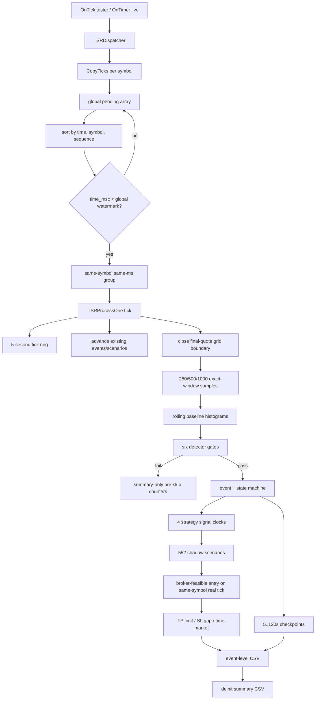

# Tick-shock研究EA As-Is architecture

## Scope and evidence boundary

This document describes the current checkpoint source exactly as it exists at Step 2. It does not validate the execution model or change production/test code. The current research EA SHA-256 is `976148D017E067728DC8827724516A076E7561C89D8D57BCD850D40DCB54A32C`; the March baseline report identifies an older EA SHA-256, `969AC0350AA64EAA1AFFFFECCA660E8CB2FB3877F4280186215A0E89251455C3`. Therefore baseline output is behavioral evidence for the pre-checkpoint implementation, not proof of the current source.

## Component composition

| Component | Path | As-Is responsibility |
|---|---|---|
| Research application | `mql/Experts/ExpectedValue_MultiCurrency_TickShockResearch.mq5` | MT5 lifecycle, multi-symbol tick collection, global merge/watermark, grid and baseline maintenance, detection, event/scenario tracking, shadow execution, CSV and summary |
| State core | `mql/Include/TickShockStateMachine.mqh` | Deterministic burst, pullback, reacceleration and invalidation transitions; general risk/exit helpers |
| Research execution core | `mql/Include/TickShockResearchExecution.mqh` | IDEAL/REALIZABLE clocks, first eligible quote rule, exact diagnostic returns, market clusters, same-ms final quote, target rounding and protective-distance checks |
| Research harness | `mql/Experts/tests/ExpectedValue_TickShock_ResearchReachabilityHarness.mq5` | 18 deterministic helper/state tests; it includes the shared headers but does not invoke the EA dispatcher/detector functions |
| Order harness | `mql/Experts/tests/ExpectedValue_TickShock_OrderReachabilityHarness.mq5` | Tester-only six-cycle Long/Short × server-SL/server-TP/time-close observation, fill aggregation and recovery-field observation |
| CSV contract | `docs/research/tick_shock_scalper_csv_schema.md` | Event/scenario/summary/spec schema and log-volume policy |

The research EA deliberately has no `OrderCheck` or `OrderSend`. Only the order harness submits orders.

## MT5 lifecycle

### OnInit

`OnInit` performs the following sequence:

1. Reads `MQL_TESTER` into `g_is_tester`.
2. Rejects invalid grid, baseline, RR, hold-time or submit-latency inputs. `InpGridMs` must be exactly 250.
3. Confirms each detector's required sample ring fits the compile-time cap.
4. Resets the global market-cluster clock.
5. Parses `InpSymbols`, calls `SymbolSelect`, reads symbol specifications, allocates rings/histograms, and creates M15/H1 EMA handles.
6. Opens four `FILE_COMMON` CSV files. Existing non-empty files are opened at EOF; headers are written only for empty files.
7. Writes `symbol_specs` rows.
8. Stores monotonic runtime start from `GetTickCount64`.
9. In live terminal only, registers a 50ms millisecond timer. Tester mode does not register the timer.

Any initialization failure closes opened files and releases created indicator handles where the call path reaches cleanup.

### OnTick

In Strategy Tester, chart-symbol `OnTick` calls `TSRDispatcher`. In live mode it does nothing. Consequently tester dispatch cadence is the driver chart symbol's NewTick cadence, not every monitored symbol's own event callback.

### OnTimer

Outside Strategy Tester, the 50ms timer calls `TSRDispatcher`. The timer polls all configured symbols using `CopyTicks(COPY_TICKS_INFO)`.

### OnDeinit

`OnDeinit` kills the live timer, flushes all pending merged ticks, converts incomplete events/scenarios to end-of-run terminal labels, writes event rows and the final summary, flushes/closes CSV handles, and releases EMA handles. Summary generation therefore occurs at deinitialization, not continuously.

## Tick acquisition and duplicate handling

For each symbol, `TSRCollectSymbolTicks` calls `CopyTicks` from `last_time_msc`. The first call requests one tick to establish a frontier; subsequent calls request at most 8,192 ticks and loop at most 64 times. `processed_at_last_msc` counts how many ticks sharing the current millisecond were already consumed. On the next `CopyTicks` call, ticks older than `last_time_msc`, and the already-seen prefix at the same `time_msc`, are skipped and counted as duplicates.

Accepted ticks are appended to the global dynamic pending array as `{symbol_index, sequence, MqlTick}`. The hard pending cap is 65,536. A cap hit increments `g_pending_capacity_hits` and stops appending that path; it does not resize beyond the cap.

## Global merge and watermark

Pending ticks are quick-sorted by the key `(tick.time_msc, symbol_index, collection_sequence)`. The dispatcher then computes:

```text
watermark = min(last_time_msc of every configured symbol)
```

No prefix is released until every symbol has a positive frontier. Only ticks with `time_msc < watermark` are released; equality stays pending so another tick with the same millisecond cannot later appear behind an already-released tick. A second guard prevents a same-symbol/same-millisecond group from being split.

This design gives a deterministic global event ordering, but the quietest symbol controls release latency. `processing_msc` is calculated once per dispatcher cycle as the maximum of `TimeCurrent()*1000` and the latest `SymbolInfoTick().time_msc` across all configured symbols. Every tick released in that cycle receives that same processing timestamp.

Global merge currently serves both diagnostics and the signal-recognition path. Thus watermark wait is included in `signal_processing_msc` for `REALIZABLE_EA`. It is not an independent per-symbol execution engine.

## Same-millisecond grouping

`TSRProcessMergedPrefix` groups adjacent ticks with the same symbol and `time_msc`. It processes all quotes in sequence, but calls `TSRAdvanceGridAtTick` only for the final quote in the group. The grid boundary matching that millisecond therefore uses the group's last Bid/Ask. Missed boundaries strictly before a tick are closed before the new quote is installed and use the last quote available before that boundary.

## Bounded in-memory data

Each `TSRSymbolContext` owns:

- a short tick ring: physical cap 8,192; old ticks are removed when more than 5,000ms behind the newest processed symbol tick;
- a 250ms grid ring: cap 64;
- three detector sample rings. With default inputs their current logical capacities are 3,610 (250ms), 1,806 (500ms), and 904 (1,000ms), bounded by compile cap 3,612;
- rolling move, tick-count and spread histograms;
- detector/gate/quality counters and EMA handles.

There are 64 active event slots. Each event contains 552 scenarios and aggregate 5/10/20/30/60/120-second checkpoints; it does not retain 120 seconds of raw ticks.

## Grid generation

The base grid is fixed at 250ms. A `TSRGridPoint` stores boundary time, source quote time, Bid/Ask/Mid, quote age and validity. Detector boundaries are independent modulo checks at 250, 500 and 1,000ms. For each boundary, the detector requires an exact grid anchor at `boundary - window`; there is no nearest-anchor fallback.

Each `TSRSecondSample`—despite its historical name—represents the configured detector window. It stores signed log return for direction/diagnostics, absolute price move for detection, window tick count, spread, and quote age.

## Baseline and detector

Each detector maintains its own rolling distribution. The inclusion interval is:

```text
baseline_end   = boundary_msc - InpBaselineExcludeMs
baseline_start = baseline_end - InpBaselineMinutes * 60,000
```

Move and tick-count distributions use samples in that interval. Spread median uses the prior 300,000ms. Histograms are rebuilt if the previous boundary is not contiguous; otherwise entering/leaving samples are adjusted incrementally. Move bins use half-tick price units. MAD is converted with 1.4826 and floored by `InpNoiseFloorTicks * tick_size`.

After baseline, quote and denominator guards, six gates are evaluated independently and cumulatively:

1. move ≥ percentile;
2. robust Z ≥ minimum;
3. path efficiency ≥ minimum;
4. tick intensity ≥ minimum;
5. move/spread ≥ minimum;
6. spread/5-minute median ≤ maximum.

The full six-bit mask and independent/cumulative counters are retained. Pre-event failures increment summary counters only. A passing sample is deduplicated by `(symbol, detector_window, detection_msc)` and allocated as an event.

## Event generation and clustering

An event captures detector window, direction, gate mask, detection/grid/source-quote/processing clocks, detector diagnostics, trend/session labels and a new `TickShockMachine`. Symbol clusters are anchored per symbol within 2,000ms. Market clusters use one global first-event anchor within 2,000ms across all symbols and detector windows.

Detection initializes the burst state and registers `detection_time_continuation`. The detection grid quote is diagnostic; under current shared clock logic it cannot be used as the scenario entry because entry requires a real tick strictly later than the signal event time.

## State machine

`TickShockMachine` follows this path:

```text
SCANNING (outside allocated event)
  -> BURST_ACTIVE
  -> WAIT_PULLBACK
  -> WAIT_REACCELERATION
  -> REACCELERATION terminal

WAIT_PULLBACK / WAIT_REACCELERATION
  -> CONTINUATION_INVALIDATED terminal
  -> PULLBACK_TIMEOUT or NO_REACCELERATION terminal
```

During burst, favorable extremes update `burst_extreme` and `last_extreme_msc`. Quiet time or maximum burst time freezes range and emits `BURST_FROZEN`. A 15–35% retracement emits `PULLBACK_VALID`; ≥50% emits `CONTINUATION_INVALIDATED`; a two-tick same-direction break beyond the frozen extreme emits `REACCELERATION`.

The enum also contains `POSITION_OPEN` and `COOLDOWN`, but the research EA event path does not enter them.

## Strategy signals and scenario grid

Four research strategies exist:

- detection-time continuation: signal at detector event;
- post-burst continuation: signal when the burst freezes;
- pullback continuation: signal on two-tick reacceleration;
- failed-shock reversal: opposite-direction signal at the invalidating tick.

Each signal initializes 23 stop widths × 3 requested delays × 2 spread multipliers = 138 scenarios. Four strategies produce 552 scenario cells per event. The index formula is documented separately in `02_data_structures_and_globals.md`.

`TSRRegisterStrategySignal` records immutable event and processing clocks and precomputes eligibility for every scenario. Policy gates (`spread/risk <= 0.20`, `risk/known_range <= 0.45`) are saved as a bitmask and do not invalidate a broker-feasible scenario.

## Shadow entry and exit

For an eligible same-symbol real tick, spread is widened around Mid for the stress case. Entry applies adverse configured slippage and adverse tick rounding. Absolute requested risk is derived from the unstressed fill spread and stop multiple, so paired 1.0×/1.25× spread cases share risk width. SL is rounded outward. TP is rounded outward so calculated realized RR is at least requested RR.

StopsLevel is checked from stressed current Bid for Long and stressed current Ask for Short. FreezeLevel is recorded separately as `freeze_clear` and is not the initial order-placement rejection gate.

Exit evaluation begins only on a tick strictly later than entry:

- TP: limit-style fill at the TP barrier;
- SL: first tradable exit-side Bid/Ask beyond SL plus adverse exit slippage, preserving gap loss;
- time: current tradable exit-side Bid/Ask at 120 seconds.

Commission is transformed to R using `OrderCalcProfit` for one lot and the configured round-turn commission input.

## CSV and summary

Four append-capable common-folder files are opened from `InpLogFolder`, `TSR_NAME`, `InpRunId` and suffix:

- events: one completed event row containing checkpoints and compact 552-cell scenario grid;
- trades: header only in this research EA;
- summary: rows written on deinit;
- symbol specs: one row per symbol on init.

No tick/grid/sample time-series CSV is written. Event rows are flushed immediately. Summary covers funnel, symbol/detector gates and masks, scenario/status outcomes, skip counts, clusters, invariants, buffers, model assumptions, memory, file sizes and runtime.

Because existing files are opened at EOF and keyed only by `InpRunId`, repeating the same RunId and folder appends another run into the same files. Header duplication is avoided, but run isolation is not enforced.

## Order harness

The tester-only order harness runs six cycles: Long and Short, each with server SL, server TP and expert time close. Its state is `SEND_ENTRY -> WAIT_ENTRY_RESOLUTION -> WAIT_PLANNED_EXIT -> WAIT_EXIT_RESOLUTION -> DONE/FAILED`.

It performs `OrderCheck` and `OrderSend`, aggregates `DEAL_ENTRY_IN` volume and weighted price in `OnTradeTransaction`, waits for full fill or terminal residual closure, reads managed-position fields, and aggregates exit deals/commission/fee/swap. Barrier plans may time out and be closed as cleanup with `SKIP`. Actual partial fill, process restart, server SL and server TP are `SKIP/NOT_OBSERVED` unless a corresponding transaction/reason is observed.

## Data-flow diagram



## Event time versus processing time

The current clock relation is:

```text
signal_event_msc      = market/grid event timestamp
signal_processing_msc = one dispatcher-cycle recognition timestamp

IDEAL_EVENT_STUDY:
  entry_eligible_msc = signal_event_msc + requested_delay_ms

REALIZABLE_EA:
  entry_eligible_msc = max(
      signal_event_msc + requested_delay_ms,
      signal_processing_msc + submit_latency_ms)

all modes:
  entry_quote_msc is a same-symbol real quote
  entry_quote_msc > signal_event_msc
  entry_quote_msc >= entry_eligible_msc

REALIZABLE_EA additionally:
  entry_quote_msc >= signal_processing_msc
```

`processing_msc` is not the timestamp of each historical tick; it is the dispatcher-cycle clock. When the watermark releases older ticks, their event time can be well before processing time.

## Current IDEAL/REALIZABLE mixing points

1. Both modes share the same global merge, watermark, event state and scenario engine. Only entry eligibility changes by enum.
2. IDEAL signals are still discovered while replaying the watermark-released stream, but processing latency is ignored for entry eligibility. It is therefore event-time research, not a deployability result.
3. REALIZABLE uses the global watermark recognition delay as execution latency. This models the current EA architecture, but mixes chart-driver cadence, quiet-symbol frontier delay and submit latency into one processing clock.
4. A single events/summary schema contains both modes. Formal-edge eligibility is a summary label, not separate storage or a separate application boundary.
5. MFE/MAE and state evolution are event-time observations in both modes, while scenario entry eligibility can be processing-time constrained only in REALIZABLE.
6. The baseline files supplied to Step 2 use an older source and schema. Their 0ms cells filled on the signal timestamp, whereas current shared clock code requires a strictly later real quote. Baseline expectancy must not be attributed to the current REALIZABLE source.

The main Step 4 architectural seam is therefore a per-symbol event-time detector plus explicit processing-clock adapter, with IDEAL analysis and REALIZABLE execution outputs separated above the shared pure state/math core.
